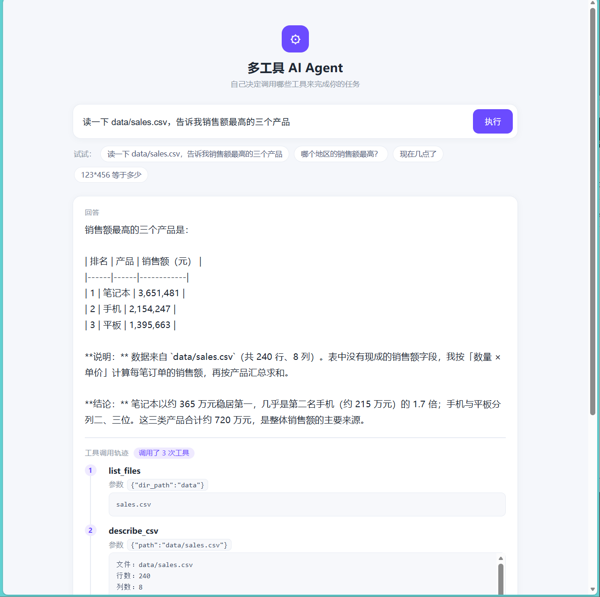

# 多工具 AI Agent（Multi-Tool AI Agent）

一个**能自己调用工具干活**的 AI Agent：给它一个任务，它自己决定**调用哪些工具、按什么顺序调**，最后给出结论。

> 本项目是一次「**能力**」与「**安全**」的权衡实践：Agent 强大到能执行代码、读文件，就必须给它划清边界。这里记录了从"危险版本"到"默认安全的工具集 + 子进程沙箱"的完整重构过程。

---

## 1. 项目简介

基于 **Function Calling** 的多工具 Agent。用户用自然语言提任务，模型自主编排工具完成，并**回显完整的工具调用轨迹**（每一步调了什么、参数是什么、结果是什么），过程透明可见。

典型任务：
> 「读一下 `data/sales.csv`，告诉我销售额最高的三个产品」

Agent 会自己完成：找文件 → 看数据结构 → 分组聚合 → 给出结论。

## 2. 项目背景

大模型本身只会"说"，不会"做"。**Function Calling / 工具调用**让它能真正操作外部世界——这正是 AI Agent 与聊天机器人的分水岭。但能力越强风险越大：一个能执行任意代码的工具，等于把机器钥匙交出去。所以本项目同时回答两个问题：
1. **怎么让 Agent 会干活？**
2. **怎么在让它干活的同时，不把数据和系统置于风险中？**

## 3. 核心功能

- 🤖 **自主决策**：模型根据"工具清单"自己决定调不调工具、调哪个、调几次（闲聊不调、需要数据才调）
- 🧰 **多工具编排**：一次提问可连续调用多个工具（如 找文件 → 看结构 → 统计）
- 📊 **本地数据分析**：在本地对 CSV 做结构探查与分组聚合，**明细数据不出本机**
- 🧾 **调用轨迹回显**：返回 `trace`，前端按时间线展示每一步，过程可审计
- 🛡️ **默认安全**：默认只挂"受限分析工具"；高危工具默认关闭，需显式开启，且运行在**子进程沙箱**中
- ⏱️ **容错健壮**：工具报错不会拖垮服务（错误作为结果喂回模型，模型可自行纠正重试）；超时强杀；格式异常自动纠正

## 4. 技术栈

| 层 | 技术 |
|---|---|
| 后端 | Python · FastAPI · Uvicorn |
| 模型 | DeepSeek `deepseek-chat`（OpenAI 兼容接口，Function Calling） |
| 数据处理 | pandas · numpy |
| 安全 | 路径白名单 · 表达式白名单 · 子进程沙箱 · 精简环境变量 · 输出截断 |
| 前端 | HTML · CSS · 原生 JS（`fetch`） |

## 5. 系统架构

```
浏览器（static/index.html）
     │  POST /agent  {"question": "..."}
     ▼
FastAPI（main.py）
     │  进入 Agent 主循环 run_agent()
     ▼
┌──────────────────────────────────────────────┐
│  ① 带上"工具清单(TOOLS_SCHEMA)" + 用户问题     │
│     请求 DeepSeek                             │
│  ② 模型回复：                                  │
│     ├─ tool_calls 为空 → 直接答，结束          │
│     └─ tool_calls 非空 → 逐个执行工具           │
│  ③ 工具执行（try/except 兜底，错误也喂回模型）  │
│  ④ 结果以 role="tool" 消息喂回模型             │
│  ⑤ 回到 ②，最多 MAX_STEPS=5 轮                 │
└──────────────────────────────────────────────┘
     │  返回 {answer, trace, steps}
     ▼
前端：答案 + 工具调用轨迹时间线
```

## 6. 项目目录

```
multi-tool-ai-agent/
├── main.py                  # FastAPI + Agent 主循环 + 工具注册
├── tools.py                 # 工具实现（含安全检查与沙箱执行）
├── data/
│   ├── sales.csv            # 示例销售数据（240 行，脚本生成的合成数据）
│   └── hard/
│       ├── orders_dirty.csv # 难度探针用脏数据（270 行：重复/缺失/千分位文本/空格/混格式）
│       └── products.csv     # 产品 → 类别/品牌 关联表（做类别统计必须 join 它）
├── eval/                    # ★ 评测集与指标（见 §14.1）
│   ├── gen_eval_set.py      # 生成主评测集（28 条，标准答案由 pandas 现算）
│   ├── gen_hard_set.py      # 生成难度探针（12 条，含脏数据注入）
│   ├── run_eval.py          # 真实跑批（调 run_agent，落盘轨迹与完整回答）
│   ├── summarize.py         # 算指标（只读结果文件，不调 API）
│   ├── scoring.py           # 判分规则（集中一处，可离线重新判分）
│   ├── verify_sandbox_path.py  # 沙箱"能做什么/不能做什么"实测
│   ├── verify_fix.py        # 缺陷 1 修复是否真的生效（4 项断言）
│   ├── metrics_*.md         # 指标汇总表
│   ├── results_*.json       # 原始结果（含每条轨迹，可逐题复查）
│   └── 难度探针-缺陷报告.md  # 发现的 4 个缺陷 + 1 个我自己的标准答案 bug
├── static/
│   └── index.html           # 前端页面（含工具调用轨迹展示）
├── tests/
│   └── check_sandbox.py     # 沙箱与安全拦截的验证脚本
├── sandbox/                 # run_python 子进程的工作目录（运行时生成）
├── generate_sample_data.py  # 合成数据生成脚本（固定随机种子，可复现）
├── requirements.txt
├── .env.example
├── .gitignore
└── README.md
```

## 7. 环境安装

```powershell
python -m venv .venv
.\.venv\Scripts\python.exe -m pip install -r requirements.txt
```

### 7.1 进入虚拟环境（激活）

本机的虚拟环境在**工作区根目录** `D:\AI-Career\.venv`（三个项目共用，不在本项目里）。
**PowerShell**：

```powershell
D:\AI-Career\.venv\Scripts\Activate.ps1
```

激活成功后命令行提示符前面会出现 `(.venv)`。**进去之后 `python` 就是 venv 的解释器**，
可以直接按 README 里的 `python xxx.py` 写法敲。

**怎么确认自己真的进去了**（三条都要过）：

```powershell
(Get-Command python).Source                              # 应指向 D:\AI-Career\.venv\Scripts\python.exe
python -c "import sys; print(sys.executable)"            # 同上
python -c "import pandas; print(pandas.__version__)"     # 应有版本号（本机 3.0.5），不是报 ModuleNotFoundError
```

**退出**：`deactivate`

**其它终端**：
```cmd
:: CMD
D:\AI-Career\.venv\Scripts\activate.bat
```
```bash
# Git Bash
source /d/AI-Career/.venv/Scripts/activate
```

**报「禁止运行脚本 / cannot be loaded because running scripts is disabled」时**：
本机 `CurrentUser` 策略已经是 `RemoteSigned`，正常不会遇到；若换机器遇到，用**最小改动**的方式：

```powershell
Set-ExecutionPolicy -Scope Process -ExecutionPolicy Bypass   # 只对当前这个窗口生效，关掉就恢复
D:\AI-Career\.venv\Scripts\Activate.ps1
```

**不想激活也行**：直接用解释器的完整路径（本 README 里 `$PY` 就是这个意思）：

```powershell
$PY = "D:\AI-Career\.venv\Scripts\python.exe"
& $PY main.py
```

**★ 一个实测出来的坑：`py -3` 会绕过虚拟环境**

| 激活后再敲 | 实际用的解释器 | 有 pandas 吗 |
|---|---|---|
| `python` | `D:\AI-Career\.venv\Scripts\python.exe` | ✅ 3.0.5 |
| `py`（不带版本号） | `D:\AI-Career\.venv\Scripts\python.exe` | ✅ |
| **`py -3`** | `C:\Users\...\pythoncore-3.14-64\python.exe`（系统 Python） | ❌ **没有** |

所以**激活了也别用 `py -3`** —— 它会把虚拟环境整个跳过。

> ### ⚠️ 解释器必须用**装了 pandas 的那个**（踩过坑，写在这里）
>
> **为什么必须强调**：`run_python` 是用 `sys.executable` 起子进程的，
> 所以**启动 Agent 用哪个解释器，子进程就是哪个解释器**。
> 如果用 `py -3`（系统 Python 3.14，没装 pandas）启动，
> 主程序能跑（因为主程序只 `import` 了 openai/fastapi），
> 但**每一次 `run_python` 都会 `ModuleNotFoundError: No module named 'pandas'`**，
> 表现为"Agent 突然不会做数据清洗了"。排查顺序：先确认 `sys.executable` 里有 pandas。
>
> **注意：激活是「每个终端窗口各自生效」的**，新开一个窗口要重新激活。
> 想省事可以把激活命令写进 PowerShell 配置文件（`notepad $PROFILE`），自行决定要不要。

## 8. 配置方法

复制 `.env.example` 为 `.env`，填入：

```
DEEPSEEK_API_KEY=sk-你的密钥
# 可选：开启高危工具 run_python（默认关闭）
# ENABLE_RUN_PYTHON=1
```

## 9. 启动方式

```powershell
# 方式一（推荐）：先激活虚拟环境，见 §7.1
D:\AI-Career\.venv\Scripts\Activate.ps1
python main.py                                  # 端口 8001
# 需要高危工具时：$env:ENABLE_RUN_PYTHON='1'; python main.py
```

```powershell
# 方式二：不激活，直接用完整路径
$PY = "D:\AI-Career\.venv\Scripts\python.exe"   # 必须是有 pandas 的那个，见 §7
& $PY main.py
# 需要高危工具时：$env:ENABLE_RUN_PYTHON='1'; & $PY main.py
```
- 网页：http://127.0.0.1:8001
- 接口文档：http://127.0.0.1:8001/docs

## 10. API 说明

| 接口 | 方法 | 说明 |
|---|---|---|
| `/` | GET | 前端页面 |
| `/agent` | POST | Agent 执行任务。请求 `{"question": "..."}`；返回 `{answer, trace, steps}` |
| `/health` | GET | 健康检查，列出当前已挂载的工具 |

`POST /agent` 响应示例：
```json
{
  "answer": "销售额最高的三个产品是：1) 笔记本 3,651,481  2) 手机 2,154,247  3) 平板 1,395,663",
  "steps": 3,
  "trace": [
    {"tool": "list_files", "arguments": {"dir_path": "data"}, "result": "sales.csv"},
    {"tool": "describe_csv", "arguments": {"path": "data/sales.csv"}, "result": "行数：240 ..."},
    {"tool": "aggregate_csv",
     "arguments": {"path": "data/sales.csv", "group_by": "产品", "value_expr": "数量*单价", "agg": "sum", "top_n": 3},
     "result": "按「产品」分组统计（数量*单价 的 sum），前 3 名：\n  笔记本\t3651481\n  手机\t2154247\n  平板\t1395663"}
  ]
}
```

## 11. Demo 截图



> 截图展示：输入任务 → 得到回答 + **工具调用轨迹时间线**（`list_files` → `describe_csv` → `aggregate_csv`）

## 12. 工具清单

| 工具 | 能力 | 安全级别 |
|---|---|---|
| `get_current_time` | 取当前时间 | 只读 |
| `calculate` | 数学表达式计算 | **字符白名单**（只允许数字与 `+ - * / ( ) . %`） |
| `list_files` | 列出目录（限项目内） | 路径白名单 |
| `describe_csv` | CSV 结构探查（列名/类型/缺失/统计） | 路径白名单，**不返回明细行** |
| `aggregate_csv` | 分组聚合（分组/求和/平均/计数/排序取前 N） | 路径白名单 + **算式白名单**，**只返回聚合结果** |
| `run_python` | 执行任意 Python 代码 | ⚠️ **默认关闭**；开启后运行在**子进程沙箱**中 |

> `aggregate_csv` 的 `value_expr` 支持简单算式（如 `数量*单价`），但只允许「**列名 + 数字 + 运算符 + 括号**」，用列名白名单校验后执行 —— 所以既能算派生指标，又不会被注入。

## 13. ⚠️ 安全说明（本项目重点）

### 13.1 发现的问题
最初 `run_python` 是在**主进程里 `exec`** 任意代码。实测（用它分析一份本地 Excel）暴露出：

1. 它**遍历了整个项目**，并用 `glob` 扫到了 `C:\Users\...\Downloads\*.xlsx` ——**读到了项目目录之外的文件**；
2. 因为缺依赖，它**自己执行了 `pip install openpyxl`** ——**擅自改动了运行环境**；
3. 读入了一份含**数万条真实姓名/学号**的表格。由于 **工具结果会回传给大模型**，这意味着**隐私数据出域**。

### 13.2 采取的改造

**（1）默认只挂"受限分析原语"** —— 把"任意代码"换成"够用的固定能力"
- `describe_csv`：只返回结构统计，**不返回明细行**
- `aggregate_csv`：本地完成分组聚合，**只把聚合结果交给模型**
- 效果：**数据在本机算，结论才上云**（数据不出域）

**（2）高危工具默认关闭**
- `run_python` 需显式设置 `ENABLE_RUN_PYTHON=1` 才挂载

**（3）开启后也要"纵深防御"**
| 防线 | 做法 |
|---|---|
| 危险模式拦截 | 禁 `subprocess` / `pip install` / 删文件 / 网络库 |
| 路径白名单 | 代码里的绝对路径必须在项目目录内 |
| **子进程隔离** | 独立进程执行，崩溃/死循环不影响主服务，**15 秒超时强杀** |
| **精简环境变量** | 子进程**拿不到任何 API key**（想外传也没凭据） |
| **输出截断** | 最多回传 4000 字符，避免海量明细灌回模型 |

**（4）出域前不过明细**
- 所有工具的返回都坚持"**结构 + 聚合**"，不返回原始数据行

### 13.3 实测验证
```powershell
$PY = "D:\AI-Career\.venv\Scripts\python.exe"
& $PY tests/check_sandbox.py
```
```
=== 检查 run_python 的子进程环境变量 ===
['PATH', 'PYTHONIOENCODING', 'PYTHONUTF8', 'SYSTEMROOT', 'TEMP', 'TMP']   ← 无任何 API key
✅ 通过：子进程拿不到 API key，沙箱生效。
  ✅ 装包：拒绝执行
  ✅ 访问项目外路径：拒绝执行
  ✅ 删文件：拒绝执行
```

### 13.4 诚实的局限
- 这套机制**不是"真沙箱"**：Windows 上无法做只读挂载与禁网，黑名单理论上可被绕过；
- **生产环境应使用容器 / gVisor 等做进程级隔离**（只读文件系统、禁网、资源限额）；
- 只要工具结果会回传模型，就存在**数据出域**风险 —— **不要用本工具处理隐私数据**（学生名册、身份证、医疗记录等），除非已脱敏。

### 13.5 一句话总结
> **能力越大，边界越要清晰。** 我们不是"因为危险就不用工具"，而是把工具设计成
> **默认安全、能力够用、边界可验证**。

## 14. 测试

```powershell
$PY = "D:\AI-Career\.venv\Scripts\python.exe"
& $PY tests/check_sandbox.py       # 验证沙箱隔离与安全拦截
```

功能测试建议：
- 闲聊（如「你好」）→ 不应调用任何工具（`steps: 0`）
- 数据分析（如「哪个地区销售额最高？」）→ 应调用 `describe_csv` + `aggregate_csv`
- 越权请求（如让它读项目外的文件）→ 应被拒绝并给出安全替代方案

### 14.1 评测集（`eval/`）—— 用真实跑批证明，而不是"我觉得它能行"

```powershell
$PY = "D:\AI-Career\.venv\Scripts\python.exe"
& $PY eval/gen_eval_set.py     # 生成主评测集（28 条；标准答案由 pandas 现算）
& $PY eval/gen_hard_set.py     # 生成难度探针（12 条脏数据任务）
& $PY eval/run_eval.py         # 真实跑批（会真调 DeepSeek，约 2 分钟）
& $PY eval/summarize.py        # 算指标（只读结果文件，不调 API，可反复重算）
```

**两套评测集的分工**：主评测集（干净数据）验"功能对不对"；
难度探针（脏数据）验"边界顶不顶得住" —— 后者才是挤出水分的那一套。

| | 主评测集 `eval_set.json` | 难度探针 `hard_set.json` |
|---|---|---|
| 数据 | `data/sales.csv`（240 行，干净） | `data/hard/orders_dirty.csv`（270 行，故意弄脏） |
| 条数 | 28（单步 10 · 多步 12 · 容错 3 · 越权 3） | 12（重复/缺失/千分位文本/空格/混格式/跨文件关联） |
| **任务完成率** | **100.0%（28/28）** | **91.7%（11/12）** |
| 工具调用成功率 | 98.0%（49/50） | 100.0%（37/37） |
| 平均完成轮数 | 2.50 | 3.50 |

> 指标文件：`eval/metrics_run_v2.md`、`eval/metrics_hard_v2.md`；
> 原始轨迹（可逐题复查）：`eval/results_run_v2.json`、`eval/results_hard_v2.json`。
> **发现的 4 个真实缺陷 + 1 个我自己的标准答案 bug** 记在 `eval/难度探针-缺陷报告.md`。

**★ 一个重要的方法论结论**：主评测集 28 条**全部通过**，却**一条缺陷都没暴露** ——
因为干净数据根本不需要 `run_python`。把数据弄脏之后，**失败立刻集中在同一条链路上**
（`run_python` 任务 **0/5**）。**评测集设计得够不够狠，直接决定能不能发现问题。**

**修复效果（有明确归因，不是"重跑一次运气好了"）**：修 `run_python` 的路径缺陷
（只改工具描述 + 加失败提示，**没放宽沙箱**）后，难度探针 **6/12 → 11/12**，
`run_python` 链路 **0/5 → 8/9**；提升的 5 条**全部**是修复前卡在这条链路上的题。

**诚实的局限**（必须写清，否则指标会骗人）：
- 主评测集那 100% 是**干净数据**上的成绩，**不能单独引用**，必须和难度探针一起看；
- 判分是"**必要不充分**"：只校验期望数字与关键词是否出现，**不能保证答案没有其他编造内容**；
- **单次运行**，模型有随机性（temperature 未固定），**1~2 条的差异不宜当结论**；
- 沙箱不是真沙箱，`_guard` 是黑名单，**理论上可被绕过**；
- 端到端"安全"主要是**靠模型自己拒绝**，沙箱在端到端里其实**没被真正考验到** ——
  要证明沙箱有效，得看**不经模型**的确定性单测（4/4 全拦截）。

## 15. Future Work

### 15.1 评测已经指出来、但**还没修**的缺陷（优先级从高到低）

> 这一节是**评测集跑出来的待办**，不是"想法清单" —— 每条都有可复现的证据。

- [ ] **★ 兜底分支绕过 DSML 泄漏检查**（`main.py`）：到 `MAX_STEPS` 后"最后再问一次"
      的兜底分支**直接返回原文**，没走 `_looks_like_tool_markup` 清洗 ⇒
      回答里会漏出 `<｜DSML｜> calls>` 这类内部标记。**恰好是最需要兜底的场景反而最容易漏**。
      （修法：兜底分支也过一次清洗，或干脆不再让模型自由生成、直接返回结构化说明。）
- [ ] **`describe_csv` 掩盖脏数据**（`tools.py`）：它用 `to_numeric(errors="coerce")` 清洗**之后**
      再报统计，还把 `object` 列标成"数值列" ⇒ 模型误以为可以直接算。
      （修法：把"原始 dtype"和"可清洗成数值"分开写，例如「**文本列**，含 15 个千分位值」。）
- [ ] **`aggregate_csv` 静默截断 `top_n`**：请求 270 名只返回前 50，**不说明被截断**。
      （修法：返回里加一句「你请求 270 名，超过上限 50，已截断」。）

### 15.2 其它

- [ ] 更完善的真沙箱（容器 / gVisor 隔离）
- [ ] 出域前自动脱敏（PII 掩码：姓名、学号、手机号）
- [ ] Human-in-the-loop：高危操作需人工确认
- [ ] 更多工具：SQL 工具、绘图、报告生成
- [ ] 多轮会话 / 上下文管理（当前每次请求无状态）
- [ ] 单元测试覆盖 + GitHub Actions（把 `eval/run_eval.py` 的判分纳入 CI，防止改代码改坏指标）
- [ ] Docker 化部署
- [ ] 评测集扩到 100+ 条并固定温度，缩小置信区间（当前单次运行，1~2 条差异不可当结论）

---

## 数据声明

`data/sales.csv` 是 `generate_sample_data.py` **脚本生成的合成数据**（固定随机种子，可复现），
**不含任何真实个人或业务信息**。

*个人学习作品，用于展示 Function Calling / 多工具 Agent / 数据安全 的完整工程实践。*
